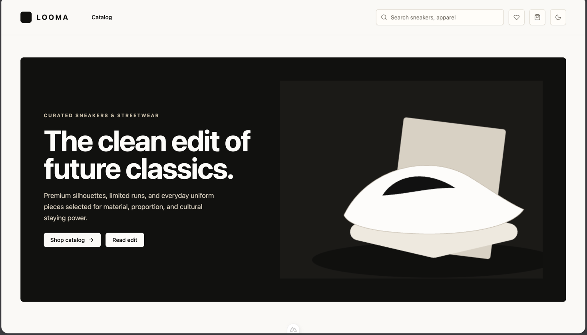
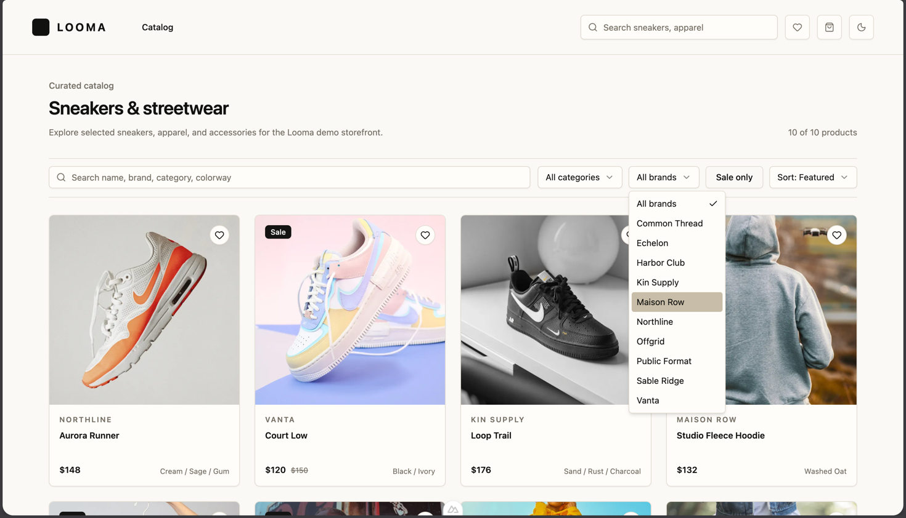

# Looma

Looma is a curated sneakers and streetwear storefront built with Nuxt 4. The project is focused on premium product discovery, editorial merchandising, and clean ecommerce flows.

The current codebase is an early foundation: normalized product data, read-only product APIs, Pinia stores, Tailwind/shadcn theme tokens, and starter catalog UI pieces are in place.

## Preview





## Stack

- Nuxt 4 with Vue 3, SSR, and file-based routing
- Nuxt server API through Nitro routes
- Tailwind CSS v4 with semantic theme tokens
- shadcn-vue via `shadcn-nuxt`
- Pinia for client-side state
- `@nuxtjs/color-mode` for light/dark mode
- `@nuxtjs/i18n` for locale setup
- `@nuxt/image`, `@nuxt/icon`, and `@nuxt/fonts`
- TypeScript and ESLint
- pnpm

## Product Direction

- Curated sneakers and streetwear storefront.
- Product-first visuals with warm neutral surfaces, restrained borders, and editorial hierarchy.
- Frontend data should use normalized Looma models instead of external API response shapes.
- Target architecture: External API -> Nuxt server -> normalization -> DB -> frontend.

Use `docs/design-notes.md` as the tracked source for design and product direction. `design.pen` is local design exploration and is not an app runtime dependency.

## Getting Started

Install dependencies:

```bash
pnpm install
```

Start the development server:

```bash
pnpm dev
```

Run lint checks:

```bash
pnpm lint
```

Build for production:

```bash
pnpm build
```

## Available Scripts

- `pnpm dev`: start the Nuxt dev server
- `pnpm build`: build for production
- `pnpm generate`: generate a static build
- `pnpm preview`: preview the production build
- `pnpm lint`: run ESLint
- `pnpm lint:fix`: auto-fix lint issues

## Project Structure

- `app/app.vue`: root app shell
- `app/layouts/default.vue`: default layout
- `app/pages/`: Nuxt pages and routes
- `app/components/`: app components grouped by feature
- `app/components/ui/`: shadcn-vue primitives
- `app/assets/css/main.css`: Tailwind entry and Looma semantic tokens
- `app/assets/images/`: local app imagery and README showcases
- `app/stores/`: Pinia stores
- `app/types/`: reusable TypeScript domain types
- `app/locales/`: i18n locale messages
- `server/api/`: Nuxt server API routes
- `server/data/`: internal mock seed data
- `server/utils/`: server-side utility location
- `public/`: static assets served as-is
- `docs/design-notes.md`: tracked design/product notes

## Current App Surface

- `/`: homepage shell and featured storefront entry
- `/catalog`: catalog view backed by normalized products
- `/products/[slug]`: product detail route by product slug
- `/cart`: cart page shell
- `/wishlist`: wishlist page shell

## Data And API

Product data currently comes from a typed mock seed at `server/data/products.ts`. It represents Looma's normalized product shape and is safe demo data.

Available read-only API routes:

- `GET /api/products`: returns `{ items, total }`
- `GET /api/products/[slug]`: returns one product by slug or a 404

Domain models live in `app/types/`, including product, cart, wishlist, and checkout types.

## State

- `app/stores/catalog.ts`: fetches and caches catalog products and product detail records by slug.
- `app/stores/cart.ts`: cart state.
- `app/stores/wishlist.ts`: wishlist state.

Keep stores consuming normalized app models from `app/types/`.

## Theme And UI

- Tailwind 4 semantic tokens are defined in `app/assets/css/main.css`.
- shadcn-compatible tokens include `background`, `foreground`, `card`, `primary`, `secondary`, `muted`, `accent`, `destructive`, `border`, `input`, `ring`, and radius mappings.
- Dark mode is controlled by the `.dark` class from `@nuxtjs/color-mode` with `classSuffix: ''`.
- Prefer shadcn-vue primitives for visible UI controls before creating custom primitives.

## Development Notes

- Keep implementation tasks small and focused.
- Do not modify `design.pen`; use `docs/design-notes.md` for tracked direction.
- Do not add dependencies unless the reason is clear.
- Avoid introducing backend services outside Nuxt server routes unless explicitly requested.
- Preserve SSR/SEO-friendly structure for catalog and ecommerce content.
